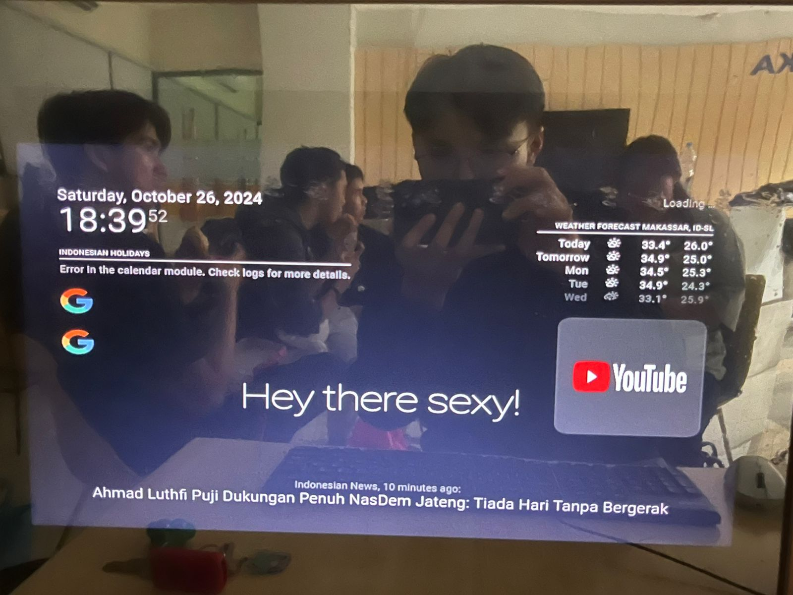
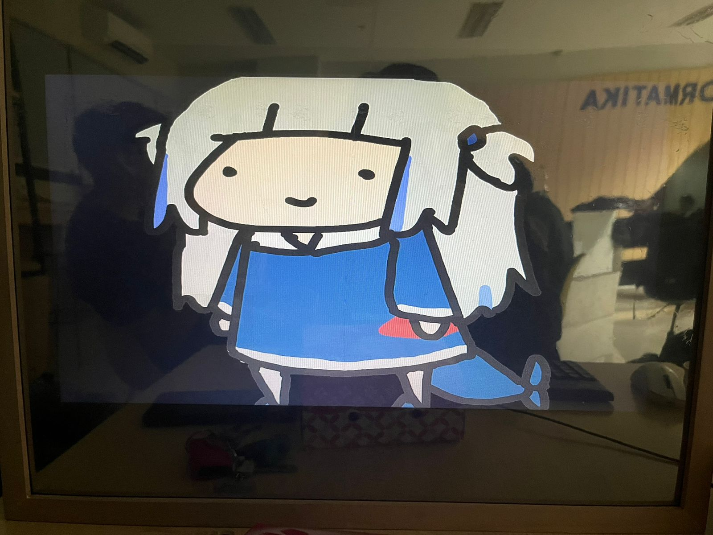
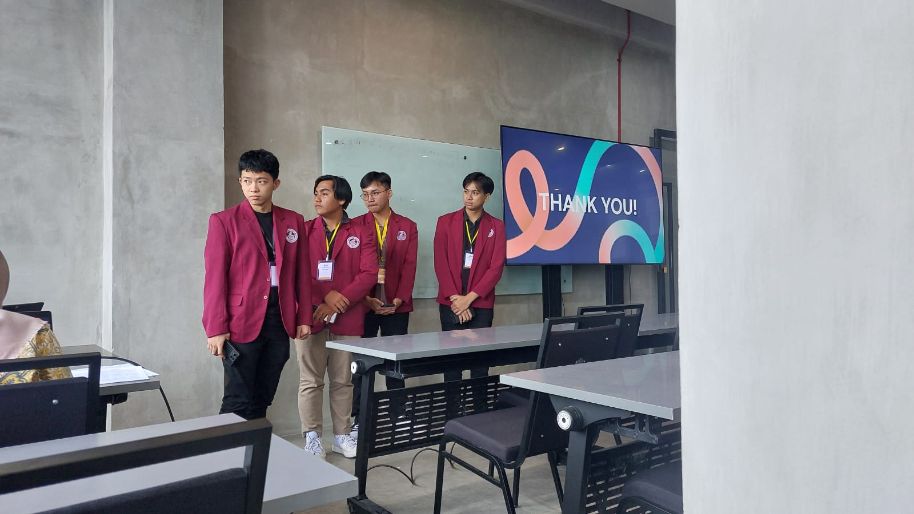

# Smart Mirror AIoT

[](https://github.com/FranklinJaya2006/Smurf_mirror/graphs/contributors)

[](https://www.linkedin.com/in/franklin-jaya-6a3697364/) [](https://www.linkedin.com/in/deny-wahyudi-asaloei/) [](https://www.linkedin.com/in/alvin-yuga-pramana-8bb5a6319/) [](https://www.linkedin.com/in/kurokusaa/)

---

<!-- PROJECT LOGO -->
<p align="center">
  
</p>

<br />

<!-- TABLE OF CONTENTS -->
<details>
  <summary>Table of Contents</summary>
  <ol>
    <li>
      <a href="#about-the-project">About The Project</a>
      <ul>
        <li><a href="#built-with">Built With</a></li>
        <li><a href="#project-dependencies">Project Dependencies</a></li>
      </ul>
    </li>
    <li>
      <a href="#conference--publication">Conference & Publication</a>
      <ul>
        <li><a href="#research-title">Research Title</a></li>
        <li><a href="#research-overview">Research Overview</a></li>
        <li><a href="#research-contributions">Research Contributions</a></li>
        <li><a href="#publication-link">Publication Link</a></li>
      </ul>
    </li>
    <li>
      <a href="#getting-started">Getting Started</a>
      <ul>
        <li><a href="#prerequisites">Prerequisites</a></li>
        <li><a href="#installation">Installation</a></li>
      </ul>
    </li>
    <li>
      <a href="#usage">Usage</a>
    </li>
    <li>
      <a href="#development-team">Development Team</a>
    </li>
    <li>
      <a href="#contact">Contact</a>
    </li>
  </ol>
</details>

---

## About The Project

<p align="center">
  
  
</p>

This project is a Raspberry Pi–based Smart Mirror integrated with Artificial Intelligence (AI), Internet of Things (IoT), and multimodal machine learning technology to provide intelligent outfit assessment and recommendation features.

The smart mirror is designed as an interactive system capable of analyzing user outfits through image processing and voice interaction. Using a camera integrated with Raspberry Pi, the system captures outfit images and processes them using a multimodal AI model powered by Gemini AI technology.

The project combines image understanding, textual reasoning, and voice interaction to provide users with outfit evaluations and recommendations in real time.

This research also addresses sustainability issues in the fashion industry by supporting the United Nations Sustainable Development Goals (SDGs), especially:

- SDG 12 — Responsible Consumption and Production
- SDG 9 — Industry, Innovation and Infrastructure

Main features include:

- AI-based outfit assessment system
- Voice command interaction
- Real-time camera image processing
- Multimodal image-text reasoning
- Smart mirror IoT integration
- Audio feedback using Google Text-to-Speech (gTTS)
- Sustainable fashion recommendation support
- Interactive smart mirror interface

The system was developed to help users make outfit decisions more efficiently while encouraging more responsible fashion consumption behavior.

<p align="right">(<a href="#readme-top">back to top</a>)</p>

---

### Built With

This project was developed using the following technologies:

[](#)
[](#)
[](#)
[](#)

<p align="right">(<a href="#readme-top">back to top</a>)</p>

---

### Project Dependencies

This project uses several AI, IoT, and computer vision libraries:

- OpenCV
- Google Gemini AI API
- gTTS (Google Text-to-Speech)
- Speech Recognition
- Raspberry Pi GPIO
- Python Multimodal Processing Libraries

Example imports used in the project:

```python
import cv2
import speech_recognition as sr
from gtts import gTTS
import google.generativeai as genai
```

<p align="right">(<a href="#readme-top">back to top</a>)</p>

---

## Conference & Publication

This project was documented and presented as part of a scientific conference paper discussing AIoT and multimodal smart mirror systems for sustainable outfit recommendation support.

<p align="center">
  
</p>

### Research Title

**Raspberry Pi–Based Smart Mirror with Multimodal AI and IoT for Sustainable Outfit Decision Support**

### Research Overview

The research proposes the development of a smart mirror integrated with artificial intelligence and IoT technology to provide users with outfit assessments and recommendations through multimodal reasoning and voice interaction.

The system utilizes:

- Raspberry Pi
- Gemini AI
- OpenCV
- Voice Recognition
- gTTS
- Multimodal AI Model

### Research Contributions

- Development of a multimodal AI smart mirror system
- Integration of image and text reasoning
- Voice-based interaction system
- Sustainable fashion awareness support
- Real-time outfit recommendation mechanism
- AIoT implementation using Raspberry Pi

### Publication Link

[ResearchGate Publication](https://www.researchgate.net/publication/400532194_Design_and_Implementation_of_a_Raspberry_Pi-Based_Smart_Mirror_with_Multimodal_AI_and_IoT_for_Sustainable_Outfit_Decision_Support)

Or DOI:

[View Research Paper](https://www.researchgate.net/publication/400532194_Design_and_Implementation_of_a_Raspberry_Pi-Based_Smart_Mirror_with_Multimodal_AI_and_IoT_for_Sustainable_Outfit_Decision_Support)

<p align="right">(<a href="#readme-top">back to top</a>)</p>

---

## Getting Started

Follow these steps to set up the Smart Mirror project locally.

### Prerequisites

Make sure you have installed the following software:

- Python 3.10+
- Raspberry Pi OS
- Webcam / USB Camera
- Git
- pip

Check your installation:

```sh
python --version
pip --version
git --version
```

---

### Installation

1. Clone the repository

```sh
git clone https://github.com/your_username/your_repository.git
```

2. Navigate to the project folder

```sh
cd your_repository
```

3. Create a virtual environment

```sh
python -m venv venv
```

4. Activate the virtual environment

**Windows**
```sh
venv\Scripts\activate
```

**Linux / Raspberry Pi**
```sh
source venv/bin/activate
```

5. Install required dependencies

```sh
pip install opencv-python
pip install gtts
pip install SpeechRecognition
pip install google-generativeai
```

6. Configure Gemini AI API Key

```python
genai.configure(api_key="YOUR_API_KEY")
```

7. Run the project

```sh
python main.py
```

---

## Usage

This smart mirror system works through multimodal AI interaction and IoT-based outfit analysis.

System workflow:

1. User gives a voice command
2. The webcam captures the outfit image
3. OpenCV processes the captured image
4. Gemini AI analyzes the outfit
5. AI generates outfit assessment and recommendations
6. Results are converted into voice output using gTTS
7. Audio recommendations are played through the smart mirror speaker

Main capabilities include:

- Outfit assessment
- Fashion recommendation
- Voice interaction
- AI-generated feedback
- Sustainable fashion support
- Real-time smart mirror interaction

<p align="right">(<a href="#readme-top">back to top</a>)</p>

---

## Development Team

This project was developed by:

1. Franklin Jaya
2. Apryadi Dwi Putra Tangalayuk
3. Alvin Yuga Pramana
4. Deny Wahyudi Asaloei
5. Citra Suardi
6. Kasmir Syariati

<p align="right">(<a href="#readme-top">back to top</a>)</p>

---

## Contact

- Franklin Jaya - [@franklinjaya_](https://www.instagram.com/franklinjaya_/) - franklinjaya827@gmail.com - [Franklin-Github](https://github.com/FranklinJaya2006)
- Apryadi Dwi Putra- [@Apryadi_](https://www.instagram.com/apryadi.d.putra) - apryadiputratangalayuk@gmail.com - [Apryadi-Github](https://github.com/Apryadi)
- Deny Wahyudi Asaloei- [@denywa__](https://www.instagram.com/denywa_/) - dwa1503@gmail.com - [Deny-Github](https://github.com/denywa)


Project Link:

```txt
https://github.com/your-username/smart-mirror-aiot
```

<p align="right">(<a href="#readme-top">back to top</a>)</p>
